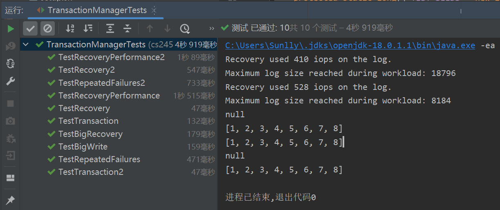
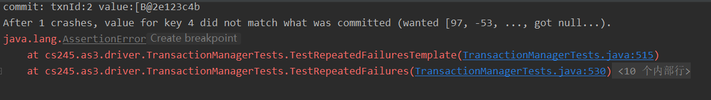
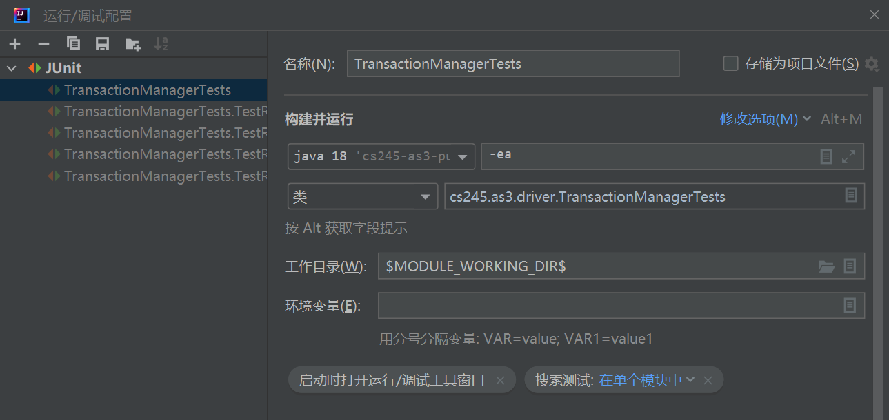

**Replicating gradescope tests locally**

The code can be compiled using Maven; the following command generates a jar file
for the entire project,

```bash
mvn package
```

You can simulate what the grader machines will do by running the autograder
script as follows:

```bash
java -Xmx1536m -Xms1536m -jar target/tests.jar
```

This will output a json file that should match the graded tests run on
gradescope.

**Submitting your solution**

Run
```bash
create_submission.sh
```

This will create a file student_submission.zip that you should upload to
gradescope.

Alternatively, just make a zip file containing **only** TransactionManager.java
with no directory structure and upload that.

**Teaching Staff Autograder Setup**

Create Autograder files and upload zip archive to Gradescope.

```bash
bash make_autograder.sh
```

## cs-245-as3 Summary

by Sunlly 2022.6.22

本项目侧重在数据库的故障恢复这一块，需要实现数据库的原子性（事务的操作要么全部执行，要么全部不执行）和持久性（事务一旦提交后，其影响将会一直持续），同时还需要实现日志截断机制以减少故障恢复后所需的工作量。

#### scr file

- /src/cs245/as3/TransactionManager.java

  项目所有需要实现的API 都集中在 TransactionManager.java 中，包括：
  + `start(long txID)`
    新事务开始时调用

  + `read(long txID, long key)`
    返回事务读取到的 key 对应的 value

  + `write(long txID, long key, byte[] value)`
    指示写入数据库。请注意，这样的写操作在 read ()调用中是不可见的（写入到的是本事务的写集缓存），直到事务进行写操作提交。

  + `commit(long txID)`
    提交事务，使写操作后续可见。需要保证其原子性和持久性。

  + `abort(long txID)`
    回滚事务，撤销操作。

  + `initAndRecover(LogManager lm, StorageManager sm)`
    发生故障并重启后，需要从 日志管理器 中读取日志，对于 commit 事务，需要 redo 其操作。

  + `writePersisted(long key, long tag, byte[] value)`
    这个函数不属于事务的实现，作用比较特殊。每当操作实际持久化的时候被调用，此时将执行日志的截断。

#### addtional file

-  /src/cs245/as3/interfaces/LogManager.java

      日志管理器(lm)，实现日志的读取（`readLogRecord(int position, int size)`）和追加写（`appendLogRecord(byte[] record)`），同时实现日志的截断（`setLogTruncationOffset(int offset)`）等。

-  /src/cs245/as3/interfaces/StorageManager.java

      存储管理器（sm），实现队列写（`queueWrite(long key, long tag, byte[] value)`）、恢复上次崩溃前持久存在的值的映射（`readStoredTable()`）。

#### test file

-  /src/cs245/as3/driver/TransactionManagerTests.java

    TransactionManager 的测试。包括no-recovery、recovery、日志截断、多次故障发生等多种场景的测试

### 项目实现

#### LogRecord

为了实现持久化操作，采用 redo log 的机制记录操作。因此，需要设计一个 LogRecord 的数据结构来记录操作。

同时，由于 logManager 存储的日志形式是byte[]的形式，需要一定的机制来实现 byte[] 到 class 的序列化和反序列化:

```java
public class LogRecord {
    public static int WRITE = 0; //write
    public static int COMMIT = 1; // commit record

    private int type;
    private long txnId;
    private long key;
    private byte[] value;

    private int size;
    private int offset;

    public static byte[] encode(LogRecord l) {
      // 将 LogRecord 转换为byte[]，以存储到logManager
    }

  public static LogRecord decode(byte[] bytes) {
    // 从 logManager 中读取日志做 redo 的时候，需要从 byte[] 转换为 LogRecord
  }
```

#### write()

此处采用的是写缓存的机制，当事务调用 write() 的时候，实际上是写到自己的写缓存（writesets）中，并没有真正应用到 Storage，对于其他的事务也是不可见的。

同时，在写的过程中通过日志将操作记录下来。(LogRecordSets)

#### read()

读取 latestValues 中key 对应的 value。由于事务在commit中是在写完日志后才更新 latestValues，所以其他事务看到的value 总是提交的事务更新的value，不会看到还未提交事务（没有commit日志标识或 abort）写入的 value。所以这里不用区分事务是本事务还是其他事务，直接读取就行。

（ps:文档中有说明：为了简单起见，我们不会在对同一个键进行写操作之后从 txID 本身读取同一个键。简化了问题）

#### abort()

当事务在中途 abort 的时候，一定不会再 commit 。由于写操作是写在缓存中的，实际上没有应用到 Storage 中，所以也不用做 undo 操作。只需要删除 LogRecordSets 日志记录和 writesets 中的缓存就行。


### 实现重点

上面几个函数都比较简单，下面是几个稍微复杂一点的函数：

#### commit()

在 commit 的时候，添加一个 `commitRecord` 到 LogRecordSet。然后对写缓存做持久化。

此时采用的策略是先将 LogRecordSet 中的 LogRecord 持久化：需要先 encode 该日志，再调用Logmanager 的追加写（`lm.appendLogRecord()`），当 commitRecord 也被持久化，此时事务就算真正commit了。

然后再对写集的操作做应用：调用 StorageManager 的队列写（`sm.queueWrite()`），这样可以保证应用到Storage 的操作一定是在事务commit的日志已经持久化之后。同时更新latestValues。

#### initAndRecover()

在发生故障恢复时，调用此函数进行初始化和恢复。

1. 首先，需要初始化 latestValues （调用 `sm.readStoredTable()`），恢复之前 sm 已经持久化的 key-value。

2. 遍历读取 logManager 中的日志，需要知道日志的长度（size）和起始位置（offset），调用`lm.readLogRecord()` 进行读取。每读取一条日志，将 offset 设置为 `offset=offset+size`。

3. 以上读取LogRecord 的过程中，记录下有 commitRecord（`type==LogRecord.COMMIT`）的事务号。这些事务后续将做 redo。

4. 对于已经 commit 的事务做 redo 操作（恢复）。具体的方式是：再次遍历 records，如果是写操作（`type==LogRecord.WRITE`），且属于 commit 的事务，则重写做队列写（`sm.queueWrite()`）以及更新 latestValues。

#### writePersisted()

这个函数在当操作持久化之后被调用，目的是实现日志的截断。

首先，为了知道日志何时可以截断，为 `TransactionManager` 设置一个数据结构：

```java
private HashMap<Long,Long> keyToTag;
```

这个结构的作用是保存已经 queueWrite 写操作的 key 对应的 tag（tag 即LogRecord的Offset，递增且能唯一标识日志），这些 tag 是进入 queueWrite 但还没有持久化的日志的对应 tag。

（ps: queueWrite 只能暂时保留值（sm.entry.latest_version），距离最后真正的持久还有一段距离（sm.entry.persisted_version））

在持久化时，需要判断当前持久化的 persisted_tag 是否是keyToTag 中记录的最小值。如果是，则说明当前持久化的 tag  是待持久化的最早的日志了，没有更早的日志还未持久化。因此可以把persisted_tag 以前的日志截断。（调用 `lm.setLogTruncationOffset()`）


### 测试结果

TransactionManager 相关的测试全部通过：



### 问题总结

#### 1. `initAndRecover()` 中 对 commit 的事务做了 redo，那么是否需要对没有commit 标识的事务做 undo?

A: 不需要，因为实现中只在 commit 的时候才真正将写缓存持久化到 Storage 中，没有 commit 标识日志的事务（abort 或者没有提交）是没有修改 Storage 中的 value 的。

同时，如果真正要 undo 的话，需要 undo log ，和 redo log 是有区别的。redo log 记录的是写后的新值，undo log 则需要写之前的旧值，才能做恢复。

#### 2. 如何对日志做 encode 和 decode？ 如何读取日志

A：此处用到了 java 的 ByteBuffer，encode 用到 allocate，decode 用到了 wrap，在 `initAndRecover()` 中 读取日志时，需要获取LogRecode 中的 size， 再调用 `lm.readLogRecord()` 进行读取。

（ps: 在自己的实现中，size 是 len(type)+len(size)+len(txnId)+len(key)+len(value)=24+value.length，long 是8 字节， int 是4 字节）

#### 3. 测试 `TestRepeatedFailures()` 时遇到问题：



A: 调试了很久，最后发现问题由于日志截断造成的。commit() 中， 将 Tag 添加到 keyToTag 的时间太早（在 日志持久化时），将其调整到 `sm.queueWrite()` 后解决。

ps: 如果前面的测试能过，TestRecoveryPerformance 和 TestRepeatedFailures 的两个测试过不了，问题多半出在日志截断上，需要仔细找找，多花点时间 debug。

### 环境配置

使用的是 IDEA， 运行配置设置为 JUnit，就能点击 Test 函数前的小三角形开始愉快的测试了~



用 IDEA 的好处是，调试更加方便，可以打断点、清楚地看到函数调用栈等。
